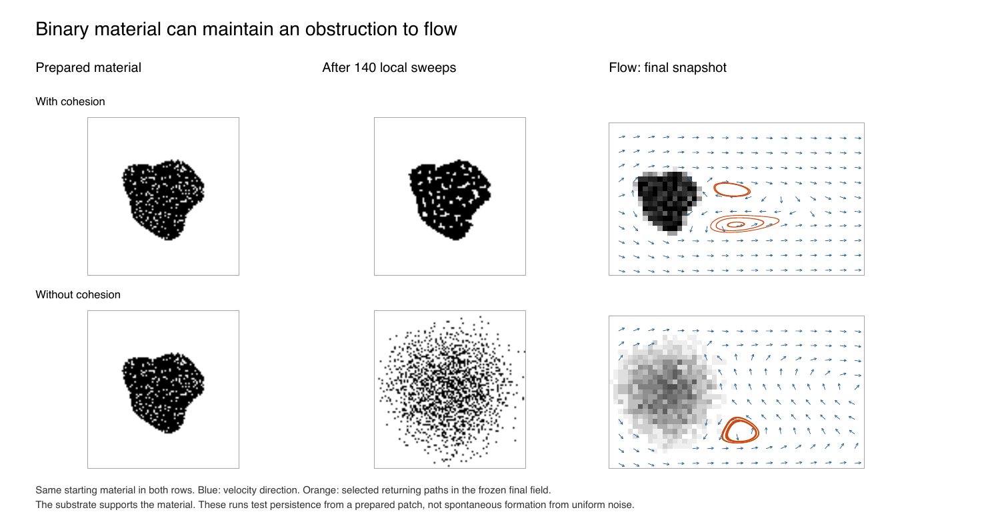

# Binary material coupled to flow

A prepared irregular patch of binary material can retain its shape under local
cohesion and create a circulating wake. The fluid reads the evolving material;
there is no independent pole mask. This is a construction for supported material,
with a specified microscopic relaxation rule and a specified fluid coupling.
It does not establish spontaneous formation from uniform noise or a closed
microscopic theory of both material and fluid.



## Rules and accounting

Each fine site holds `b=0` or `b=1`. Occupied nearest neighbours contribute one
favourable bond, so `H=-J sum_<ij> b_i b_j`, with `J=1`. A local exchange of unlike
neighbours is accepted when it does not increase H. Neutral exchanges are allowed.
Every exchange conserves the occupied-site count. The implementation checks the
local energy change against a separately computed whole-grid bond count.

Conserved exchange has precedent in [Kawasaki's lattice dynamics](https://doi.org/10.1103/PhysRev.145.224).
Here the update order is a deterministic integer permutation of initially unlike
bonds, changed at each sweep. New unlike bonds wait until the next sweep. This is
zero-temperature dissipative relaxation with a chosen schedule, not a thermal
Kawasaki sampler, a reversible molecular dynamics model, or a derivation of physical
noise. Initial configurations use a seeded generator; evolution draws no further
random numbers. The earlier chaotic fine-lattice model has different rules.

A fluid cell reads a 4 by 4 fine block: `s=sum(b)/16`. Thus a binary layer supplies
values in increments of 1/16. At each collision, reflected populations obey

```text
f_out,a = (1-s) f_collision,a + s f_collision,opposite(a).
```

This rule follows exactly if each directional packet is split equally among the
16 sub-sites, reflected at occupied sites, and remixed before the next step.
That remixing is a modelling assumption: occupancy alone does not determine a
real pore's permeability. The repartitioning rule has precedent in
[gray lattice Boltzmann models](https://doi.org/10.1038/s41598-018-24151-2);
we do not transfer their calibrated permeability relations to this construction.
The underlying fluid populations remain real-valued D2Q9 variables. This experiment
derives the material occupancy from bits, not the entire fluid solver from bits.

Reflection conserves fluid mass locally. It changes local momentum from p to
`(1-2s)p`; the implicit substrate receives `2s p`. The substrate also receives the
energy released by favourable exchanges. Material does not advect or erode under
fluid forces in this approximation. This supplies support without fixing a pole
mask, but does not explain the persistence of a freely suspended clump. Open fluid
boundaries supply and remove fluid; material has periodic boundaries and no source
or sink. Total material is exactly conserved in every retained sweep.

## Retained results

All runs use 180 by 60 fluid cells, inlet speed .03, nominal radius 6 and 14,000
fluid steps. One material sweep precedes each 100 fluid steps. The nominal Reynolds
number is 40 except for the Re=2 control, which changes viscosity at fixed inlet
speed. The prepared patch is approximately radius 6 with an irregular outline and
88% random occupancy inside it. Seeds change the fine holes, not the supplied
large-scale outline. There is no random forcing during evolution.

| Case | Initial overlap retained | Largest dense component (cells) | Returning tracers / 120 | Final wake change / inlet speed |
|---|---:|---:|---:|---:|
| Cohesive patch, seed 0 | 95.6% | 110 | 43 | 0.0066 |
| Cohesive patch, seed 1 | 96.1% | 112 | 30 | 0.0211 |
| Cohesive patch, seed 2 | 95.5% | 110 | 39 | 0.0103 |
| Same material dispersed, seed 0 | 25.9% | 0 | 0 | 0.0026 |
| Material cannot reflect fluid | 95.6% | 110 | 0 | <0.0001 |
| Re=2 | 95.6% | 110 | 0 | 0.0001 |
| 2 by 2 fine blocks | 93.2% | 110 | 36 | 0.0088 |
| No cohesion, same initial patch | 55.6% | 44 | 3 | 0.2230 |

Overlap is `sum min(s_initial,s_final)/sum s_initial`; it measures spatial occupancy,
not the identity of individual particles. A dense component uses four-neighbour
connectivity at occupancy at least .5. The cohesion-free control accepts all
proposed unlike exchanges: it spreads, yet has residual circulation at this
horizon. Neither absence of eventual circulation nor necessity of cohesion follows.
The dispersed control forms small bonded aggregates (29 initial bonds become 682)
but no coarse dense feature during the observed time. That is not evidence that
such a feature could never form.

The three main runs conserve respectively 1,599, 1,631 and 1,601 occupied sites.
Their bond counts increase from 2,726/2,839/2,726 to 2,881/2,961/2,889. The control
without cohesion ends with 1,062 bonds from the same 2,726 and the same 1,599 sites.
Thus persistence is not implemented by making the material immutable.

The circulation diagnostic is the existing frozen-field tracer-return check:
120 initial positions, 32,000 steps of length 2, cumulative velocity turning
above 2 pi, path length above 12 and return within one fluid cell. Any occupied
coarse cell excludes a tracer. Returning trajectories are not independent
simulations or a count of vortices. They show recirculation in the final field,
not permanent trapping in the evolving field. The table's wake change compares
steps 12,000 and 14,000 on x=42..59, across all y. Changes close to the material
are larger: whole-field maxima for the three main runs are 0.108, 0.147 and 0.132
of inlet speed. The fluid is not claimed exactly stationary.

The 2 by 2 block run checks that the effect is not confined to one binary averaging
choice. It is not a continuum-convergence test: microscopic spacing, initial mass
in bits and material time scales differ. The previous fixed-pole checks include
fluid-grid refinement; this new coupled construction does not yet. No threshold
in material lifetime, noise strength or Reynolds number is inferred from these
few settings. The reflection closure and material support remain assumptions.

## Reproduce

From the repository root, with NumPy (ReportLab and Pillow only for the figure):

```sh
python -m unittest discover -s tests
python -m sims.validation.run_material --output /tmp/material-rerun
python -m sims.validation.plot_material
```

The figure runner reads the retained data here. Each case has a result JSON,
a 140-row material history and an NPZ with initial/final bits, coarse snapshots,
final velocities and tracer paths. `manifest.json` records settings and source
hashes. The three added balance tests bring the repository suite to 23 passing
tests. The main paper gives only the connection and its limits; this experiment
adds a specified possibility, not a new law or a new selection threshold.
