# Each experiment in one sentence, with its figure

## Core (the theorem and its checks)

**1. Concentration, forty routes.** When channels sharing a fixed flow are disturbed in proportion to how much they carry, the flow ends up concentrated on a few of them, and when they are disturbed equally it doesn't.

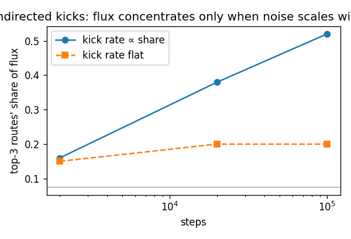

**2. Heredity, copying climb.** When busy channels also copy their state to neighbours more often, the whole population's average state rises steadily, and without either the copying or the activity-scaled disturbance it goes flat.

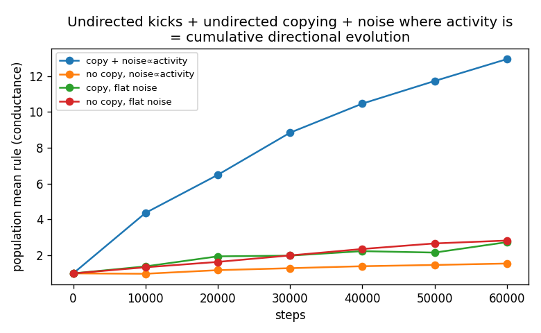

**3. Exponent sweep on the toy line.** When share and disturbance both rise with state to the same power, concentration appears only once that power reaches one, slowly at exactly one and fast above it.

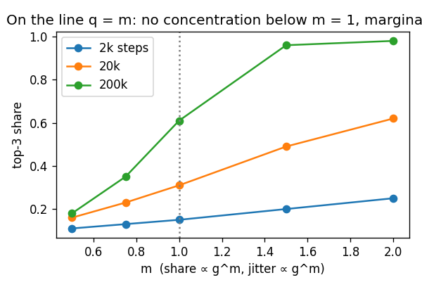

**4. Selection window, exact law.** Concentration of flow onto a vanishing few happens only when disturbance grows with state at least linearly and no more than one power faster than flow does, and outside that window it never happens however long you wait.

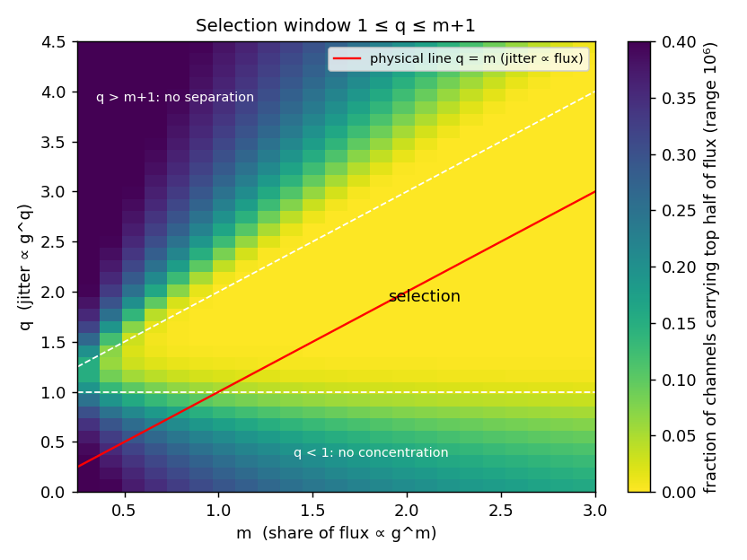

**5. Write-back, free sign.** When each channel's own flow can rewrite its state with a sign that starts random, the channels whose flow reinforces them take over the population, and without copying they win the flow but don't spread.

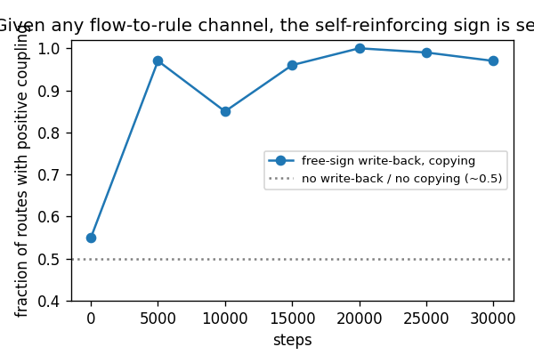

**6. One substrate, no channel drawn.** When material obstructs flow, flow moves material according to the material's own nature, and material spreads where flow is, the kind that clears its own path takes over the substrate without any rule connecting flow to material being written in.

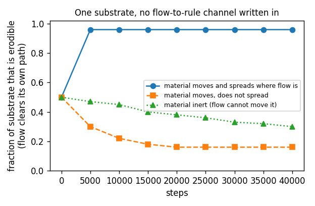

**7. q from published exponents.** Where fluctuation size versus size has been measured, cities, firms, GDP and growing networks all land inside the predicted window, and the firm case is nearly but not exactly right, with the gap explainable by the upper tail not yet being stationary.

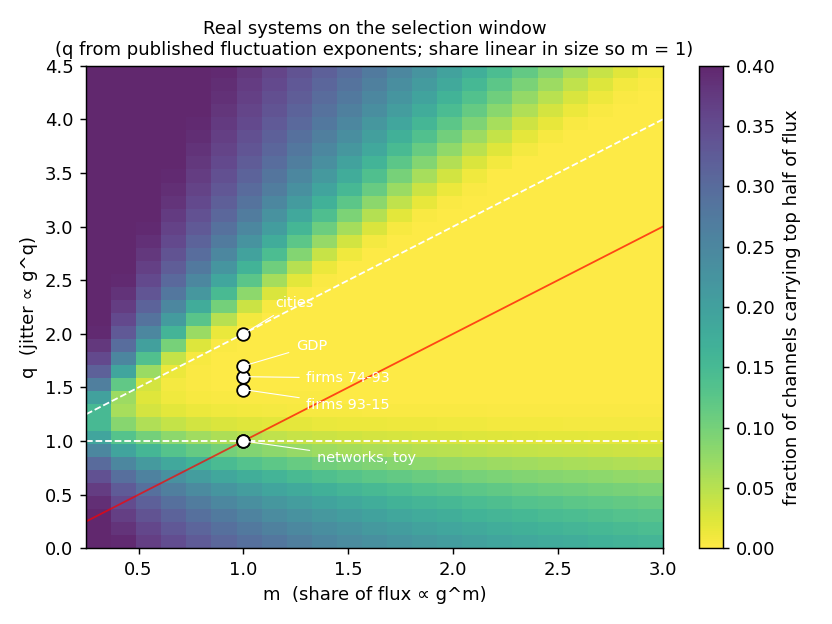

**8. Mutation from unseen layers.** In a world with no randomness anywhere, mutation appears as the blur of a deterministic layer too fine to see, falls hardest on the busiest channels simply because they touch more of the world, and that alone concentrates the flow; and a perfectly predictable churn does it too, so what selection needs is disturbance that is blind and scaled, not random.

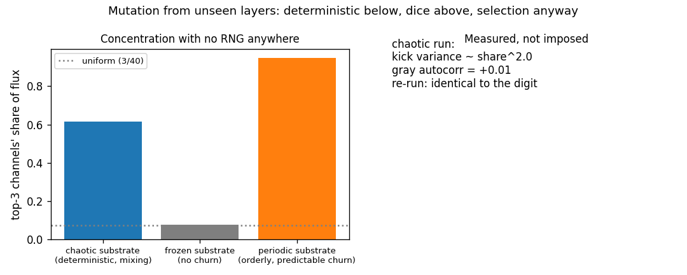

**9. Footprint: q emerges.** When a channel's contact with the churning substrate grows with its share, independent patches add their jitters and the noise-scaling exponent emerges as one, exactly the D ∝ J hypothesis, derived from geometry rather than assumed; a single shared signal gives two instead, at the window's far edge; and noise that hits all channels identically selects nothing, because variation only counts when it differs between competitors.

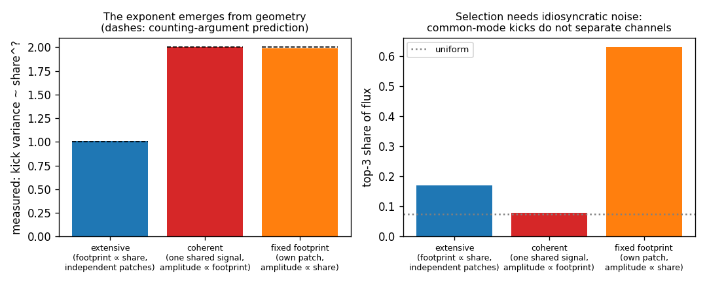

**10. Heredity from flow.** In an incising network with a persistent bed, a daughter branch resembles its parent beyond what proximity explains (excess correlation +0.21 with no memory ingredient added), and turning up bed healing erases the excess entirely, so heredity self-emerges in the slow layer and dies when the slow layer forgets; the first version of this measurement was confounded by smoothness and corrected with a distance-matched null, and the correction is part of the record.

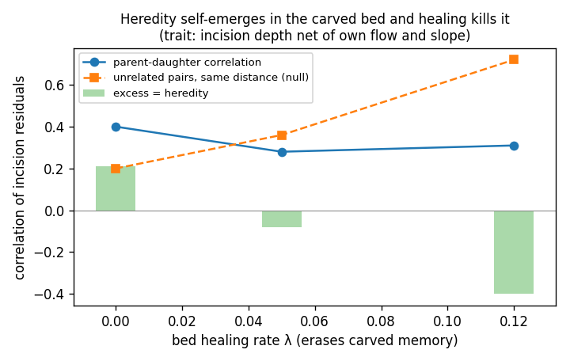

**11. Re-templating erases sorting (consistency check).** Pull every channel back toward the environment-dictated shape and concentration dies as deviations stop outliving the run: near-tautological, recorded because the original theorem silently assumed it away. The open successor experiment: with copying on, deviations need only survive until copied, so copying should rescue heredity from re-templating in proportion to share, making fitness feed back on heritability.

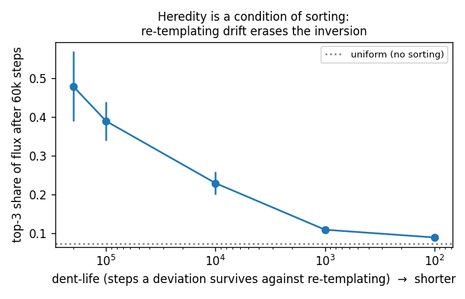

**12. Copying rescues heredity.** A deviation no longer needs to outlive the world's forgetting, only the wait until it is copied, so replication acts as memory refresh: the population climb survives re-templating that kills sorting alone, the rescue grows with copy rate, and since copying is funded by share, fitness itself buys longer heredity.

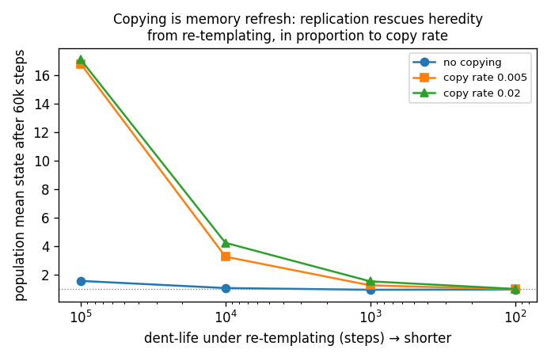

**13. Portability (rung 3, first pass).** A gated token of state, shed downstream and read by its configuration wherever it lands, shapes flow at sites its parent's water never touched, above a shuffled-token null, and the transported self-reinforcing rule sweeps the substrate from half to ninety-five percent; gating shown sufficient, necessity still owed a clean control.

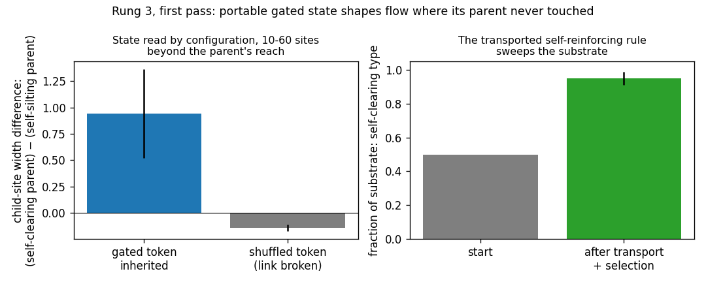

## Boundaries (what linear systems cannot do)

**8. Lattice flow past a disc.** When a flow is driven past an obstacle, a closed loop appears above a threshold and grows with drive, and with the momentum term removed no loop forms at any drive.

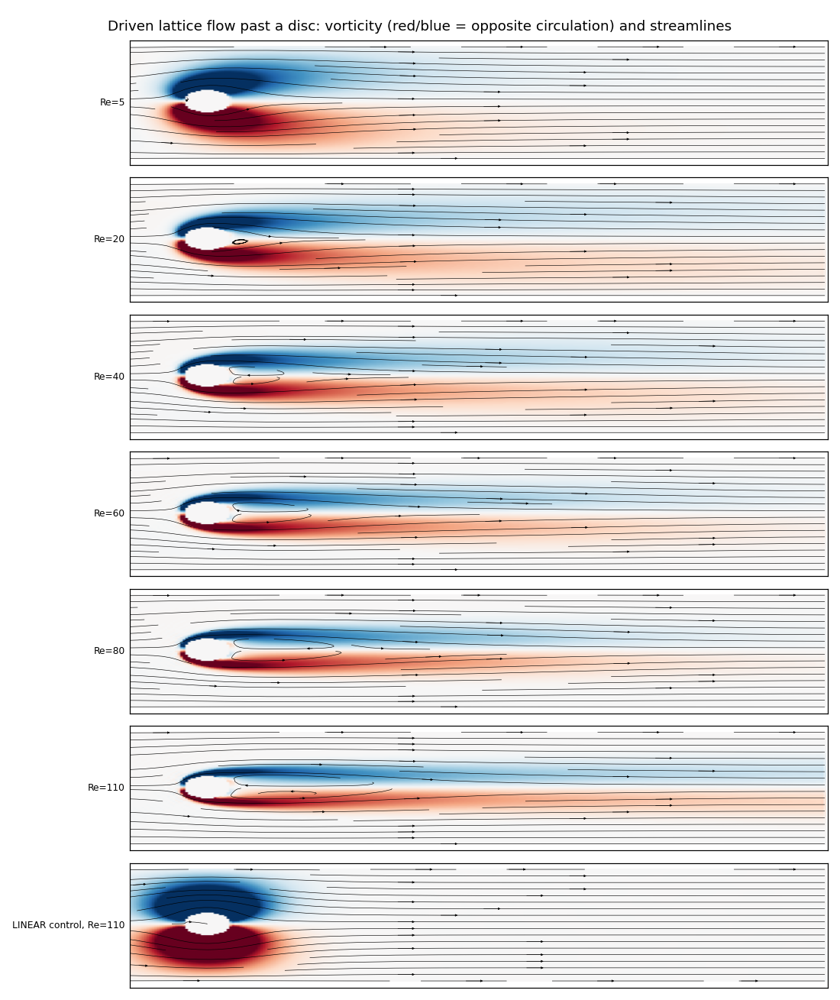

**9. Memory gate versus dial.** A memory that is continuously rewritten only forgets more slowly however strong you make it, and a memory that writes only changes above a threshold holds a pattern indefinitely.

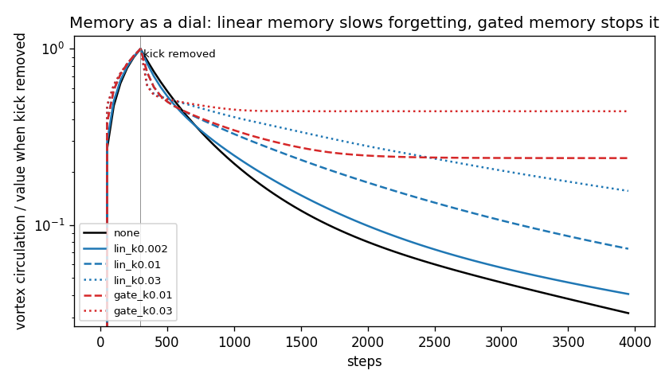

**10. Plateau channel network.** (Conceptually, the flow-past-a-disc experiment is a zoom into this one: stand close enough to any reach of any channel on the plateau and you are watching flow past an obstacle, which is where the loops live. The plateau is the wide shot, channels competing for the rain; the disc is the close-up, what one obstruction in one channel does to the flow. Not literally the same simulation, the plateau routes water without momentum, but the same world at two magnifications, and the loop is what a channel looks like from inside.)

**10. Plateau channel network.** When cutting rises with the water passing, rain on a noisy plateau carves itself a channel network in which a few channels carry most of the drainage, and when cutting depends on slope alone it erodes as a smooth sheet.

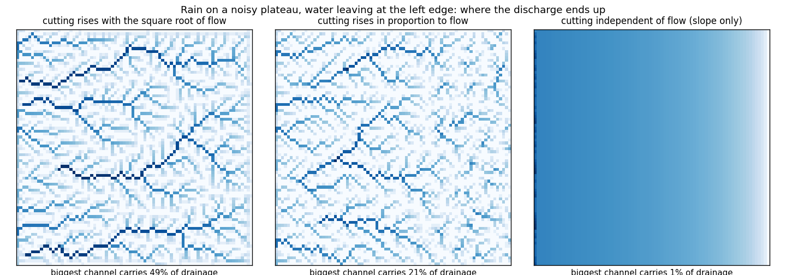

**11. Blinking gradient.** When a gradient is switched on and off over a linear medium, storage earns a little extra throughput but no pattern ever forms.

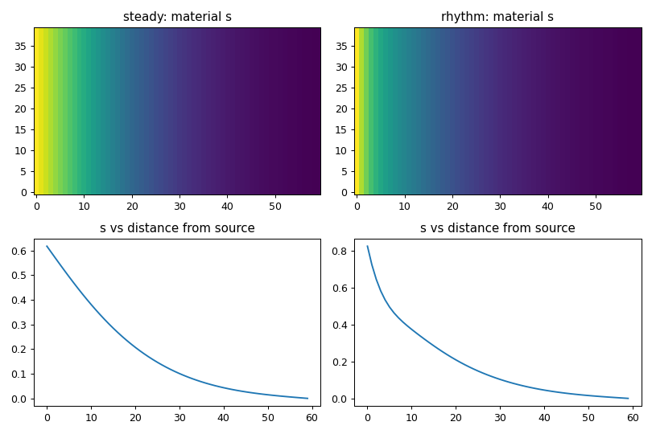

**12. River-bed hybrid.** When a loop forms behind a bump, removing the flow and keeping the bump lets the loop regrow, and keeping the flow and removing the bump kills it for good, so the memory lives in the slow layer and not in the flow.

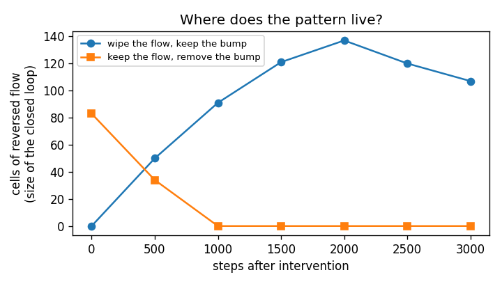
